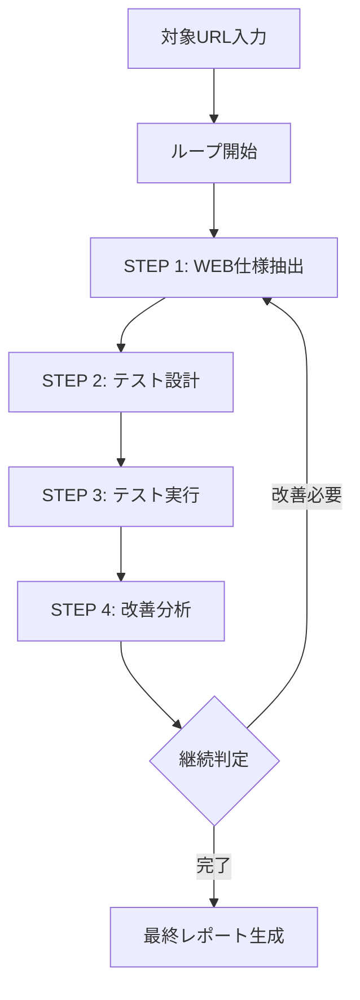

# 🚀 ループ型マルチエージェントテストシステム

## 概要

既存のWebアプリケーションに対して「仕様書生成 → テスト設計 → テスト実行 → 改善点とエビデンス収集 → 再ループ」という流れを自動化する**ループ型エージェント処理システム**です。

### 🌟 新機能: 自動化ループシステム
- **WEBアプリURL解析**: 対象サイトから自動的に仕様書を生成
- **マルチエージェントテスト設計**: 既存の4エージェント体制でテストケース自動生成
- **統合テスト実行**: 人間介入型テスト実行とエビデンス収集
- **改善分析・ループ制御**: 失敗分析に基づく改善提案と自動再実行

### 🎯 従来システム（引き続き利用可能）
テストベースのマルチエージェントテスト設計・実行システム。人間による介入をサポートし、テストベースの特性に適したテスト手法を提供します。

## システム構成

### 2つのアプリケーションサーバー

1. **テスト設計アプリケーション** (ポート5003)
   - マルチエージェントによるテスト要求分析
   - テスト設計書の自動生成
   - テスト項目書の作成

2. **テスト実行アプリケーション** (ポート5001)
   - テストベーステスト実行
   - 人間による介入のサポート
   - テスト結果の管理・エクスポート

## 特徴

### テストベース評価手法

| スタイル | 特徴 | 例 |
|---------|------|-----|
| Human-in-the-Loop Driven | 人間による確認・判断をシナリオに組み込む | LED確認など |
| Manual Trigger Driven | 人間がトリガーを操作することが前提 | スイッチ操作、検体セットなど |
| Observer Driven | 人間やセンサーが観察して結果を判断 | 音・振動・光など |
| Semi-Automated BDD | 自動+手動のハイブリッド設計 | ステップごとに自動化可能性を評価 |

## セットアップ

### 前提条件

- Python 3.8以上
- Ollamaサーバー（ローカルまたはリモート）

### インストール

1. リポジトリをクローン
```bash
git clone <repository-url>
cd multiagent_testdoc
```

2. 依存関係をインストール
```bash
pip install -r requirements.txt
```

3. Ollamaサーバーを起動
```bash
ollama serve
```

4. 必要なモデルをダウンロード
```bash
ollama pull llama3.2
```

## 使用方法

### 🔄 新機能: ループ型自動化システム

**クイックスタート:**
```bash
# 最もシンプルな実行
python run_loop_system.py --url https://example.com

# ループ回数を指定して実行
python run_loop_system.py --url https://your-webapp.com --max-loops 3
```

**詳細オプション:**
```bash
python run_loop_system.py \
  --url https://your-webapp.com \
  --max-loops 5 \
  --verbose
```

📖 **詳細な使用方法**: [QUICKSTART.md](QUICKSTART.md) を参照

### 🎛️ 従来システム: 手動ワークフロー

**システム起動:**
```bash
python start_apps.py
```

両方のアプリケーションが同時に起動します：
- テスト設計アプリ: http://localhost:5003
- テスト実行アプリ: http://localhost:5001

### ワークフロー

1. **機能仕様書のアップロード**
   - テスト設計アプリで機能仕様書（Markdown形式）をアップロード
   - マルチエージェントがテスト要求を分析

2. **テスト設計の実行**
   - 4つのエージェントが並行してテスト設計を実行
   - 要求分析、テスト設計、品質保証、リスク分析

3. **テストケースのダウンロード**
   - 生成されたテストケースをCSV形式でダウンロード

4. **テスト実行**
   - テスト実行アプリでテストケースをアップロード
   - 実行スタイルを選択（Human-in-the-Loop等）
   - 人間による介入を含むテスト実行

5. **結果のエクスポート**
   - テスト実行結果をCSV形式でエクスポート
   - 人間による介入記録も含む

## 🔄 ループ型処理フロー

### 全体フロー概要



### 詳細処理フロー

#### 🌐 STEP 1: WEB仕様抽出
```
対象URL
    ↓
HTMLコンテンツ取得
    ↓
UIコンポーネント解析 (BeautifulSoup)
    ↓
機能推定 (Ollama LLM)
    ↓
仕様書生成 (Markdown)
    ↓
requirements.md 保存
```

#### 🔧 STEP 2: マルチエージェントテスト設計
```
機能仕様書
    ↓
┌─────────────────────────────────┐
│  4エージェント並行処理           │
│  • Requirements_Analyst         │
│  • Test_Designer               │  
│  • Quality_Assurance          │
│  • Risk_Analyst               │
└─────────────────────────────────┘
    ↓
テスト要求統合
    ↓
テストケース生成
    ↓
test_cases.csv 出力
```

#### ▶️ STEP 3: テスト実行とエビデンス収集
```
テストケース (CSV)
    ↓
┌─────────────────────────────────┐
│  4つの実行スタイル選択           │
│  • Human-in-the-Loop Driven    │
│  • Manual Trigger Driven      │
│  • Observer Driven           │
│  • Semi-Automated BDD        │
└─────────────────────────────────┘
    ↓
各テストケース実行
    ↓
結果記録・エビデンス収集
    ↓
execution_results.json 保存
```

#### 📊 STEP 4: 改善分析とループ制御
```
テスト実行結果
    ↓
失敗テスト抽出
    ↓
エビデンス収集 (スクリーンショット・ログ)
    ↓
改善提案生成 (Ollama LLM)
    ↓
次回ループ計画策定
    ↓
継続判定
    ↓
improvement_analysis.json 保存
```

### 🏗️ システムアーキテクチャ

#### 統合レベル別動作

**🌟 フル統合モード**
```
Ollama LLM + テスト設計アプリ + テスト実行アプリ
    ↓
最高品質の解析・テスト実行
    ↓
リアルタイム Web UI 連携
```

**⚡ 部分統合モード**
```
利用可能コンポーネント + 代替処理
    ↓
柔軟な運用継続
    ↓
段階的品質向上
```

**🛡️ 基本モード**
```
スタンドアロン動作
    ↓
最小限の依存関係
    ↓
確実な基本機能提供
```

### 🎯 ループ制御ロジック

#### 継続判定条件
```python
# ループ継続の場合
if (失敗テスト数 > 0) or (重要改善提案数 > 1):
    次のループを実行
    
# ループ終了の場合  
if (失敗テスト数 == 0) and (改善提案数 <= 1):
    システム安定と判定 → 終了
    
# 強制終了条件
if ループ回数 >= 最大ループ数:
    最大回数到達 → 終了
```

#### 出力ファイル管理
```
loops/
├── loop-001_YYYYMMDD_HHMMSS/
│   ├── requirements.md           # 抽出仕様書
│   ├── spec_extraction.json      # 抽出詳細データ
│   ├── test_design_result.json   # テスト設計結果  
│   ├── test_cases.csv            # テストケース
│   ├── execution_results.json    # 実行結果
│   ├── improvement_analysis.json # 改善分析
│   └── evidence/                 # エビデンス
├── loop-002_YYYYMMDD_HHMMSS/
└── final_report_YYYYMMDD.json    # 最終統合レポート
```

### 📈 パフォーマンスメトリクス

#### 実行時間目安
- **STEP 1 (仕様抽出)**: 10-30秒 (Ollama処理含む)
- **STEP 2 (テスト設計)**: 30-60秒 (4エージェント並行)  
- **STEP 3 (テスト実行)**: 20-40秒 (テスト件数による)
- **STEP 4 (改善分析)**: 15-25秒 (Ollama処理)
- **1ループ合計**: 約1.5-3分

#### スケーラビリティ
```
軽量サイト  → 1-2ループで完了
一般サイト  → 2-3ループで安定化  
複雑サイト  → 3-5ループで品質向上
```

## アーキテクチャ詳細

### 従来システム（引き続き利用可能）

#### テスト設計システム
```
機能仕様書
    ↓
マルチエージェントシステム
    ↓
テスト要求分析
    ↓
テスト設計書
    ↓
テスト項目書
```

#### テスト実行システム
```
テスト項目書
    ↓
テスト実行エージェント
    ↓
人間による介入
    ↓
テスト結果
    ↓
フィードバック
```

## ディレクトリ構造

```
multiagent_testdoc/
├── 🔄 ループシステム (新規)
│   ├── loop_system.py           # コアループシステム
│   ├── system_integration.py    # 既存システム統合ヘルパー
│   ├── run_loop_system.py       # メイン実行スクリプト
│   ├── test_system.py          # システムテスト・デモ
│   ├── QUICKSTART.md           # クイックスタートガイド
│   └── loops/                  # ループ結果保存ディレクトリ
│       └── loop-001_*/         # 各ループの詳細データ
├── 🏗️ 既存システム
│   ├── test_design_app/        # テスト設計アプリケーション
│   │   ├── app.py             # メインアプリケーション
│   │   └── templates/         # HTMLテンプレート
│   ├── test_execution_app/     # テスト実行アプリケーション
│   │   ├── app.py             # メインアプリケーション
│   │   └── templates/         # HTMLテンプレート
│   ├── multiagent/            # マルチエージェント基盤
│   │   ├── multi_agent_system.py  # BOSS-Workerシステム
│   │   ├── agent.py           # エージェント定義
│   │   ├── ollama_client.py   # Ollama LLM クライアント
│   │   └── config.py          # エージェント設定
│   └── start_apps.py          # 既存アプリ起動スクリプト
├── 📂 データディレクトリ
│   ├── inputreq/              # 機能仕様書保存
│   │   └── sample_spec.md     # サンプル仕様書
│   └── test_results/          # テスト結果保存
├── 📄 ドキュメント・設定
│   ├── README.md              # このファイル（メイン）
│   ├── QUICKSTART.md          # ループシステム使用ガイド
│   └── requirements.txt       # 依存関係
└── 📊 出力結果
    ├── loops/                 # ループごとの詳細データ
    ├── final_report_*.json    # 最終レポート
    └── test_results_*.json    # システムテスト結果
```

## 技術仕様

### 使用技術

- **バックエンド**: Python, Flask, SocketIO
- **フロントエンド**: HTML5, CSS3, JavaScript, Bootstrap
- **AI/ML**: Ollama, LLM
- **データ形式**: JSON, CSV

### エージェント構成

#### テスト設計エージェント
- **Requirements_Analyst**: 要求分析エキスパート
- **Test_Designer**: テスト設計エキスパート
- **Quality_Assurance**: 品質保証エキスパート
- **Risk_Analyst**: リスク分析エキスパート

#### テスト実行エージェント
- **Test_Executor**: テスト実行エージェント
- **Human_Interface**: 人間介入インターフェース
- **Result_Analyzer**: 結果分析エージェント

## トラブルシューティング

### システム診断

**自動診断ツール:**
```bash
# システム全体の動作確認
python test_system.py --test

# クイックデモ実行
python test_system.py --demo
```

### よくある問題

1. **Ollamaサーバーに接続できない**
   - Ollamaサーバーが起動しているか確認
   - `ollama serve` を実行
   - **注意**: Ollamaなしでも基本機能は利用可能

2. **アプリケーションが起動しない**
   - ポート5003, 5001が使用中でないか確認
   - 依存関係が正しくインストールされているか確認
   - プロセス強制終了: `lsof -ti:5001,5003 | xargs kill -9`

3. **ループシステムでエラーが発生する**
   - システムテストを実行: `python test_system.py --test`
   - `--no-auto-start` オプションを使用して手動でアプリを起動
   - ループ回数を削減: `--max-loops 2`

4. **テスト設計が失敗する**
   - 機能仕様書の形式を確認
   - Ollamaモデルが利用可能か確認
   - 代替処理モードで実行される場合があります

5. **メモリ不足・パフォーマンス問題**
   - ループ回数を削減
   - 複雑なサイトの場合は段階的にテスト
   - システムリソースを確認

## ライセンス

このプロジェクトはMITライセンスの下で公開されています。

## 貢献

プルリクエストやイシューの報告を歓迎します。

## 連絡先

ご質問やフィードバックがある場合は、イシューを作成してください。 